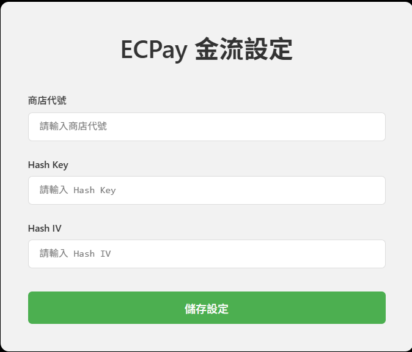

# 綠界斗內系統

一隻鼠閒閒沒事做來用的工具，可以找我聊聊天喔

---

## 功能

- 📋 **綠界斗內列表**：顯示來自綠界的斗內紀錄
- 🎯 **三種募資條樣式**：
    1. **普通募資** — 傳統進度條
    2. **打怪扣血版** — 斗內會扣血
    3. **血壓上升版** — 你不說話就會上升ㄛ

---

## 📖 使用說明

1. **註冊與設定**  
   先到綠界後台進行設定：

    - 登入綠界後台 → 系統設定
    - 填入以下資訊：
        - `商店代號`
        - `介接 HashKey`
        - `介接 HashIV`

    

2. **使用功能**

    - **首頁**
      

    - **綠界列表**（網址可直接複製到 OBS）：  
      

    - **募資列表**：  
      

    - **目標募資活動**（網址可直接複製到 OBS）：  
      

## ⚡ 授權

GPL3.0

## 贊助我

