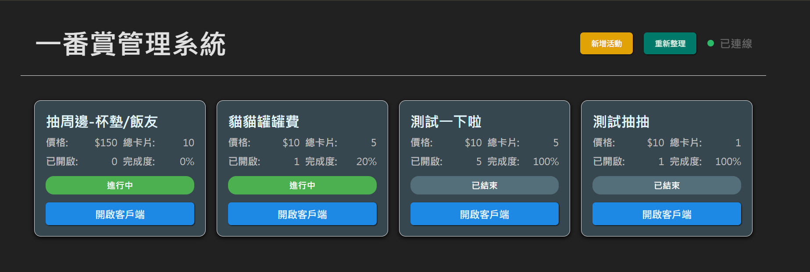
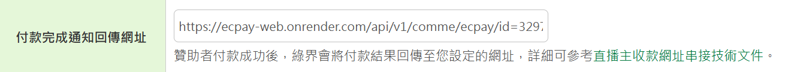

# 🎀 Shiliya Common Vote (直播互動小幫手)

Hi 妳好！👋 歡迎來到這個專案！  
這是一個專門為了 **直播互動** 設計的超級小幫手系統。  
不管妳是要辦 **一番賞抽獎**、**收贊助**，還是跟觀眾一起玩 **YouTube 互動**，這個小工具都能幫妳輕鬆搞定！💖

---

## ✨ 它可以幫妳做什麼？ (Features)

這個系統就像是妳的數位管家，主要有以下幾個厲害的功能：

_(這是妳的操作主控台，功能一目瞭然！)_

### 1. 🎁 一番賞 / 抽獎活動 (Ichiban Kuji)

想要在直播上跟粉絲玩一番賞嗎？這個功能超方便！

- **建立活動**：妳可以自己設定獎品清單（像是 A賞、B賞、還有大家最想要的 Last賞！）。
  
  _(不管是誰抽的、還剩多少獎品，後台通通看得到！)_

- **線上抽籤**：系統會幫妳管理還有幾張籤、剩餘的獎品是什麼，公平又清楚。
  
  _(隨時掌握每一抽的狀態，公平公正公開！)_

- **客戶端畫面**：有一個漂亮的畫面可以秀給觀眾看，讓大家更有參與感！(`ichiban-client`)
  
  _(讓觀眾也能看到現在剩幾抽，增加緊張刺激感！)_

### 2. 💰 抖內與募資 (Donations & Fundraising)

怕漏掉粉絲的心意嗎？或是想要集資做一個大企劃？

- **綠界金流 (ECPay) 整合**：直接幫妳串接好台灣最常用的綠界支付，粉絲可以用信用卡、ATM 轉帳。
- **募資活動**：設定一個目標金額（例如：3D 化募資！），讓大家一起看著進度條往前衝。

_(可以同時進行好幾個活動喔！)_

_(看著進度條越來越滿，是不是很有成就感呢？)_

- **自動對帳**：粉絲付款成功後，系統會自動顯示，不用自己辛苦刷存摺對帳囉。

_(誰贊助了多少錢、說了什麼話，全部都幫妳記下來了！)_

### 3. 📺 YouTube 連動 (YouTube Integration)

- **Super Chat 監聽**：系統會幫妳注意有沒有收到 Super Chat，不錯過任何一則抖內留言。
- **投票與互動**：可以跟聊天室的觀眾一起進行投票遊戲。

### 4. ⚙️ 簡單的後台設定

- **設定頁面**：不用寫程式，直接在畫面輸入妳的綠界商店代號 (Merchant ID) 就可以開始使用了。

---

## 💖 第一次使用：只需 3 步驟！ (First Time Setup)

打開小幫手程式後，妳會看到一個設定畫面，只要填入綠界金流 (ECPay) 的資料，就能開始收款囉！

### 步驟 1：準備好鑰匙 🗝️

請先登入妳的綠界後台（或是測試環境後台），依照下圖指示：

1. 點選左側選單的 **「系統設定」**
2. 選擇 **「系統介接設定」**
3. 就能找到我們需要的三個資料囉！

_(記得要在這邊找到這三串神秘代碼喔！)_

1.  **商店代號 (Merchant ID)**：這是妳的商店身分證。
2.  **Hash Key**：這是第一把密碼鑰匙。
3.  **Hash IV**：這是第二把密碼鑰匙。

### 步驟 2：輸入資料 📝

回到小幫手的畫面，依序填入剛剛找到的三個資料：

_(把剛剛找到的資料填進來，不用擔心，這個只會存在妳的電腦裡！)_

- **商店代號**：填入 Merchant ID
- **Hash Key**：填入 Hash Key
- **Hash IV**：填入 Hash IV

### 步驟 3：儲存並開始 ✨

按下 **「儲存設定」** 按鈕。
如果是第一次設定，系統會自動帶妳進入主畫面，這時候魔法就生效啦！
以後妳的一番賞、募資活動，都會自動連結到這個商店帳號喔！

### ⚠️ 重要提醒：設定回傳網址

為了讓小幫手知道有人付款成功了，記得要把「回傳網址」填回綠界後台喔！

_(這樣粉絲抖內成功時，小幫手才會馬上知道並跳出通知！)_

---
