# 🎀 鼠做小工具｜直播主看得懂的使用說明

嗨～這是一套給直播／實況主用的小幫手：**斗內、募資條、一番賞、OBS 通知**都在同一個後台，不用開一堆網頁。  
下面照「從登入到開播」的順序，**搭配截圖一步一步對照**就好（含金流後台去哪抄資料）。

---

## 🌐 先記住這兩個東西

- **雲端網址**：[https://ecpay-web.onrender.com/](https://ecpay-web.onrender.com/)
- **測試用商店代號**：`3002599`（想摸摸看功能可以用這組）

---

## 1. 登入頁：輸入商店代號就進得去

在「商店代號」欄位輸入代號，按藍色 **「進入」**。  
畫面底下那句俏皮小字，是提醒還沒填好的人可以去把商店資料補齊～

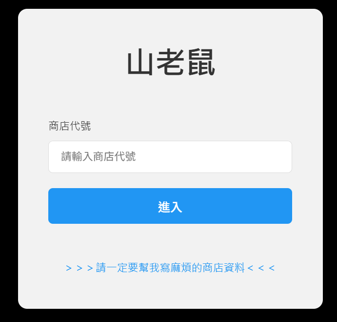

_圖說：這裡就是入口，代號對了就能進後台。_

---

## 2. 雙重驗證（若妳有開）

若商店有啟用雙重驗證，會看到這頁：照手機或驗證器上的 **6 碼**輸入，按 **「驗證登入」**；若要退回上一頁按 **「返回」**。

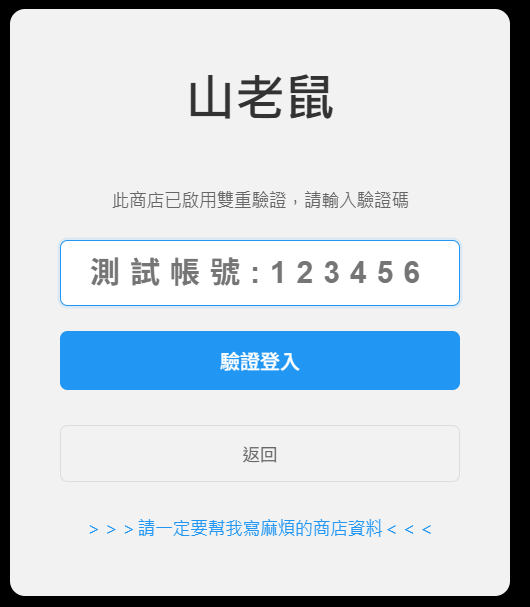

_圖說：多一層保護，不用怕別人亂登入妳的店。_

---

## 3. 第一次綁定金流：綠界或 PAYUNi 擇一即可

第一次使用時，可能會先到 **「商店金流設定」**。  
照妳實際用的那一家，點分頁填好三個欄位後按 **「儲存設定」** 就對了（另一家可以不填）。

### 用綠界時

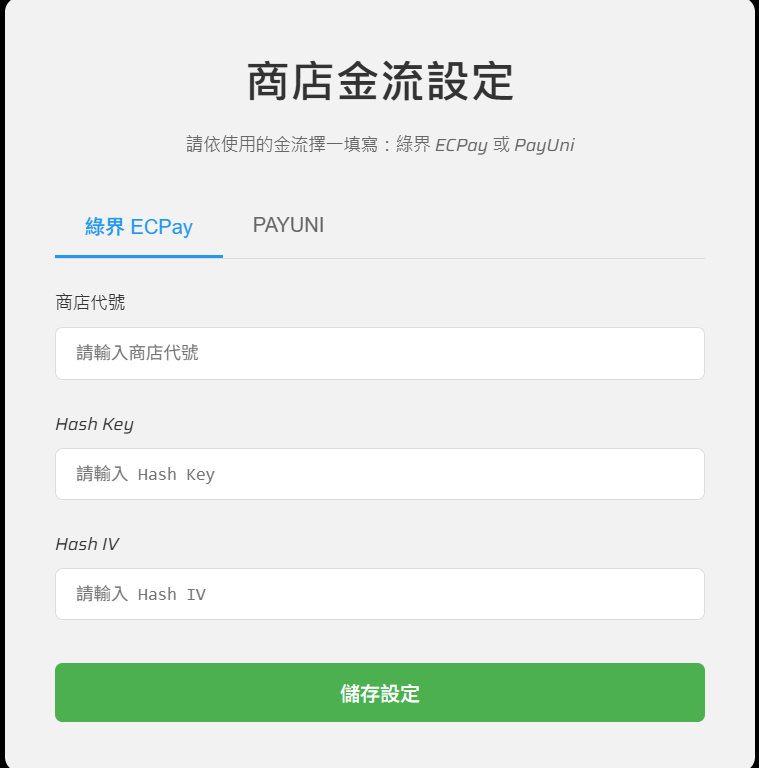

_圖說：把金流後台給妳的商店代號與兩組金鑰填進來，存檔後就能收款。_

不知道這三個欄位要去哪裡抄？登入 **綠界** 商店後台，進 **「系統設定」→「系統介接設定」**，畫面上會看到 **商店代號**、**介接 HashKey**、**介接 HashIV**，用複製貼上到小幫手即可。底下若有字型辨識小字（0 跟 O、1 跟 l 之類），貼上時稍微對一下，減少打錯。

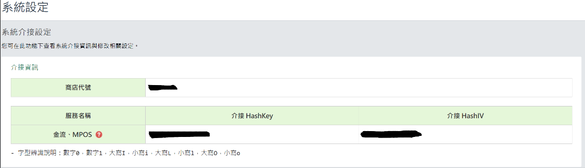

_圖說：對照這張就知道進哪一頁抄商店代號與兩組金鑰。_

### 用 PAYUNi 時

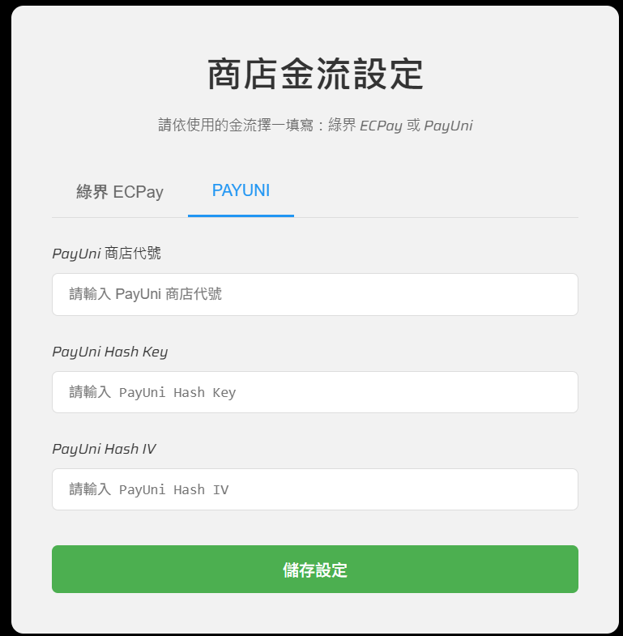

_圖說：同上，只是換成 PAYUNi 那一頁在填。_

不知道要去哪抄？登入 **PAYUNi**（HiveBee）商店後台，點 **「串接設定」** 分頁，在 **API 串接金鑰** 區會看到 **商店代號**、**Hash Key**、**IV Key**，各自有複製按鈕，貼回小幫手三個欄位即可。

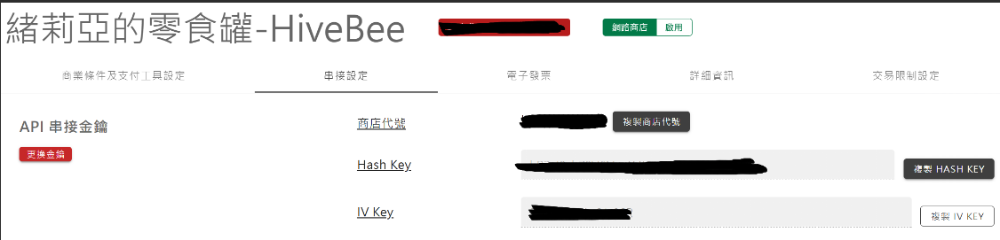

_圖說：對照這張找串接設定與三個複製按鈕。_

---

## 4. 主畫面：左邊選功能、右邊看內容

登入成功後會看到 **「鼠做小工具」**。左側是功能選單；還沒點任何功能時，中間會提示「請從左側選單選擇功能」。右上是 **設定** 與 **登出**。

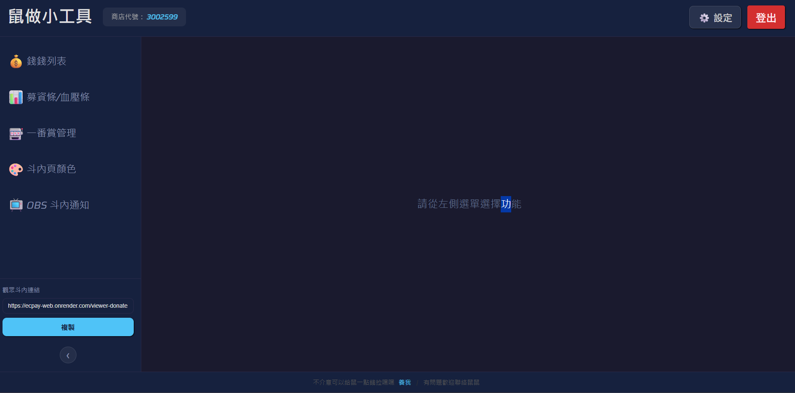

_圖說：這就是妳的總中控台，之後都從左邊開始點。_

---

## 5. 觀眾斗內連結：貼給粉絲的那條

左下角 **「觀眾斗內連結」** 按 **「複製」**，貼到聊天室、資訊欄或社群就行。  
（這條是給觀眾斗內用的，不是給妳管後台的網址喔。）

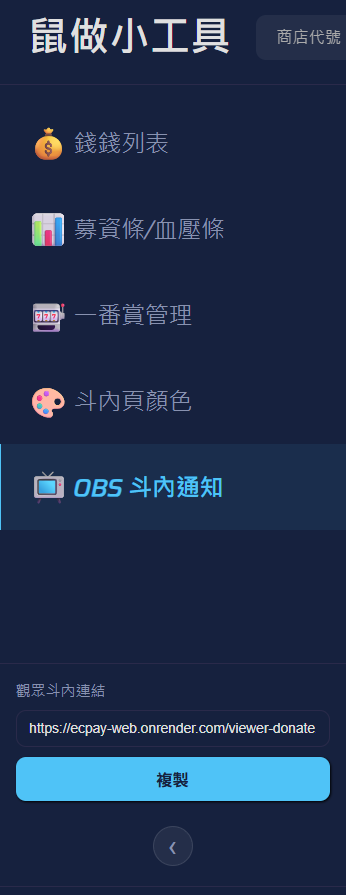

_圖說：一鍵複製，少打網址、少出錯。_

---

## 6. 設定頁（按右上角「設定」進來）

這裡有四個分頁：**基本設定、綠界、YouTube、PAYUNi**。建議先填 **基本設定**，再用哪個金流就填哪個分頁。

### 基本設定

- **顯示名稱**：會影響觀眾斗內連結怎麼產生，請填妳希望粉絲看到的名字。
- **封鎖關鍵字**：用逗號分隔，留言裡有這些詞就不顯示，斗內區可以乾淨一點。

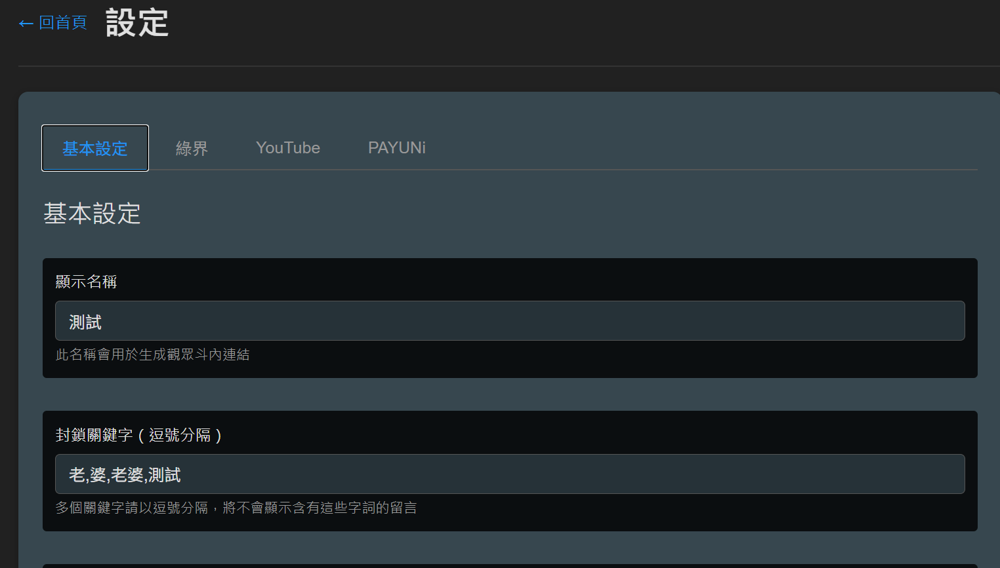

_圖說：名字給觀眾看，關鍵字幫妳擋掉不想看的字。_

### 綠界（平常在這裡改也可以）

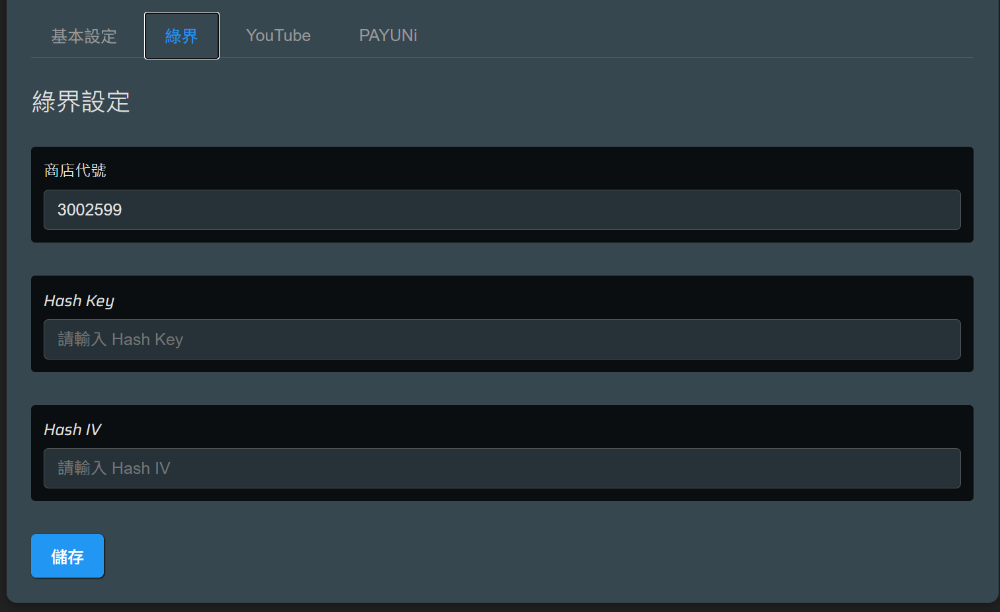

_圖說：之後要改綠界資料，就回到這個分頁存檔。_

### PAYUNi

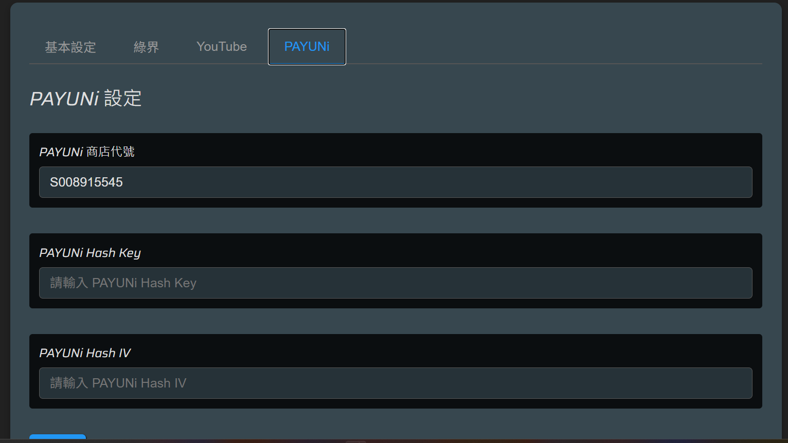

_圖說：用 PAYUNi 的話，三個欄位填好按儲存。_

### YouTube

填 **頻道 Handle（@開頭）** 跟 **頻道 ID**，儲存後就能搭配 YouTube 相關功能使用。

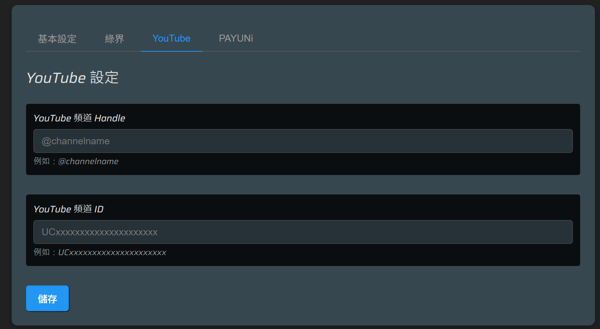

_圖說：把頻道身分告訴小幫手，超 Chat 等互動才對得到人。_

---

## 7. 錢錢列表：斗內跑馬燈給 OBS 用

- 上面會有一條 **「OBS 瀏覽器來源網址」**，複製後貼到 OBS 的瀏覽器來源。
- **綠界 / YT / PAYUNI** 三個勾勾：想顯示哪幾種來源的斗內就勾哪幾個。
- 下面的預覽區可以看到像素風格的名字、金額、留言、時間大概長什麼樣子。

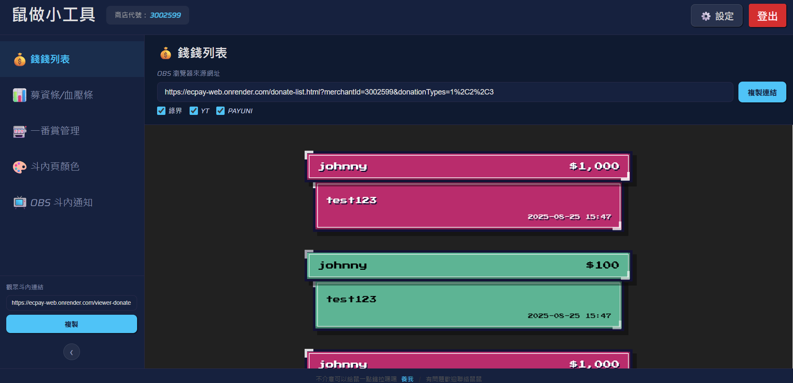

_圖說：直播畫面上那一串感謝清單，就是從這裡生出來的。_

---

## 8. 募資條／血壓條：目標進度給大家一起衝

這裡是 **斗內活動列表**：可以新增活動、重新整理，每張卡片會顯示活動名稱、狀態、進度條，還有查看、改標題、暫停、關閉等按鈕。  
把進度條丟進實況畫面，觀眾會更有「一起灌爆」的感覺。

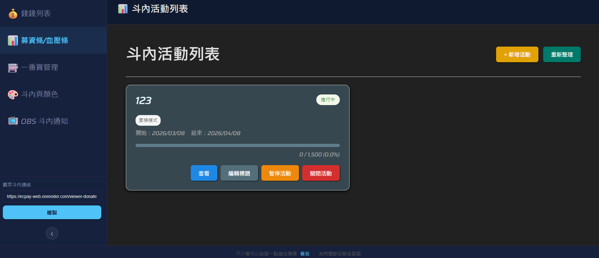

_圖說：辦募資、辦小目標，從這裡開關與看進度。_

---

## 9. 一番賞管理：抽獎活動一眼看完

每個活動一張卡：**價格、總卡片、已開啟、完成度**都看得到；狀態是進行中時，可以按 **「開啟客戶端」** 讓觀眾那邊也有畫面。  
右上角還能 **新增活動**、**重新整理**，並會顯示連線狀態。

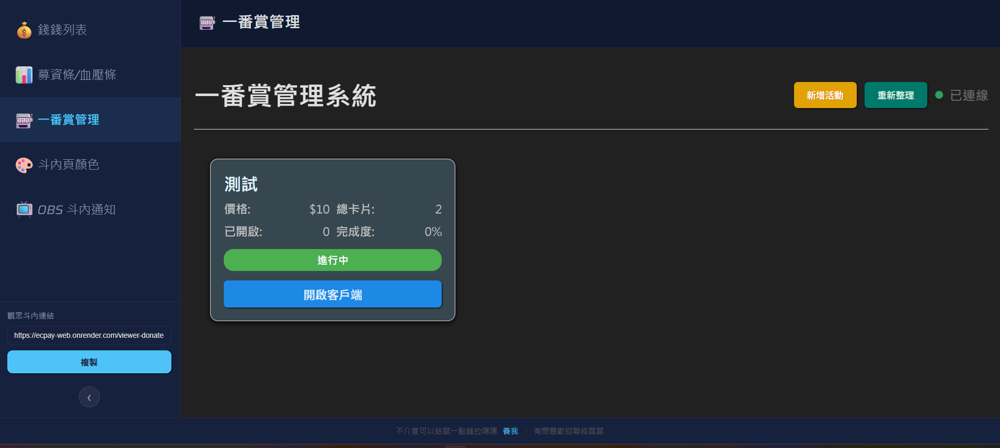

_圖說：辦抽獎不用再心算還剩幾張，小幫手幫妳記。_

---

## 10. 斗內頁顏色：觀眾看到的斗內頁長什麼樣

左邊調 **按鈕、文字、連結、錯誤訊息** 等顏色，右邊 **即時預覽** 很像觀眾真實會看到的畫面（暱稱、金額、留言、綠界／PAYUNi 按鈕）。  
調好可以 **儲存**、**在新分頁預覽**，或 **還原預設**。

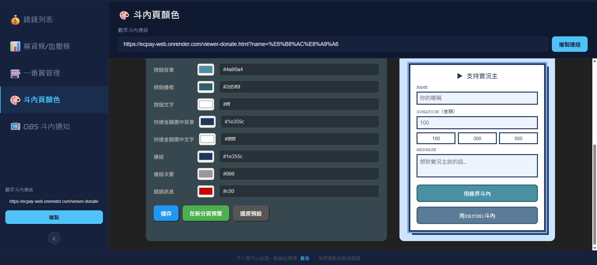

_圖說：斗內頁也要美美的，跟妳的實況風格搭得起來。_

---

## 11. OBS 斗內通知：有斗內就跳出來

- 複製 **瀏覽器來源網址** 到 OBS，畫面上會提示記得勾 **「透過 OBS 控制音訊」** 比較聽得到提示音。
- 頁面會提醒 **不要隨便把這條網址公開**，避免別人亂玩妳的通知畫面。
- 可以 **在新分頁開啟預覽**，並用拉桿調 **提示音音量**（調完建議再複製一次連結）。
- 「自訂通知外觀」若顯示即將開放，之後會再開放更進階的外觀玩法。

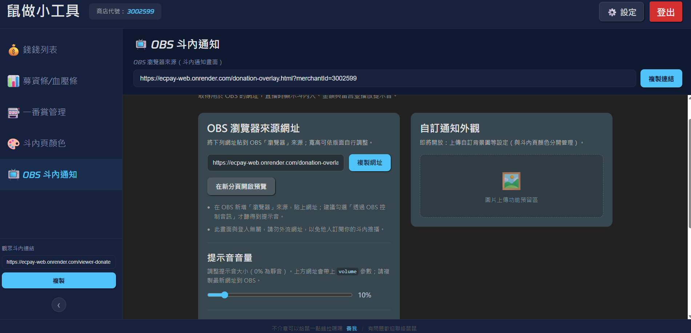

_圖說：斗內進來時，實況畫面要跳提示＋有沒有響，就看這一頁。_

---

## ✅ 開播前小檢查（俏皮但實用）

- 登入的 **商店代號** 沒打錯、沒多空格。
- **基本設定** 的顯示名稱有填，觀眾連結才會長得合理。
- 金流 **綠界或 PAYUNi** 至少有一邊有存檔成功。
- **觀眾斗內連結** 複製貼給觀眾的是「斗內頁」，不是 OBS 那條。
- **錢錢列表** 的 OBS 網址有貼進 OBS，勾選要顯示的來源（綠界／YT／PAYUNI）。
- **OBS 斗內通知** 有先預覽一次，音量順耳、畫面不爆版。
- 有開 **雙重驗證** 的話，手機或驗證器先準備好，開台當天才不慌。

---

祝妳每場直播都順順的，斗內滿滿、互動滿滿！🫶✨
