# 🎀 Shiliya Common Vote (直播互動小幫手)

Hi 妳好！👋 歡迎來到這個專案！  
這是一個專門為了 **直播互動** 設計的超級小幫手系統。  
不管妳是要辦 **一番賞抽獎**、**收贊助**，還是跟觀眾一起玩 **YouTube 互動**，這個小工具都能幫妳輕鬆搞定！💖

### 🌐 入口網站

若不想自架，可直接使用雲端版：[**https://ecpay-web.onrender.com/**](https://ecpay-web.onrender.com/)  
登入後即可使用斗內、一番賞、募資條等功能。

---

## ✨ 它可以幫妳做什麼？ (Features)

這個系統就像是妳的數位管家，主要有以下幾個厲害的功能：

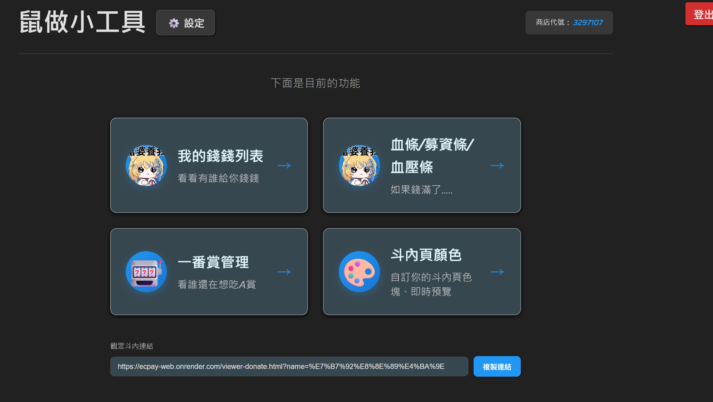
_(這是妳的操作主控台，功能一目瞭然！主畫面還包含「觀眾斗內連結」與「斗內頁顏色」入口，方便妳複製連結給觀眾、自訂斗內頁風格。)_

### 1. 🎁 一番賞 / 抽獎活動 (Ichiban Kuji)

想要在直播上跟粉絲玩一番賞嗎？這個功能超方便！

- **建立活動**：妳可以自己設定獎品清單（像是 A賞、B賞）。
  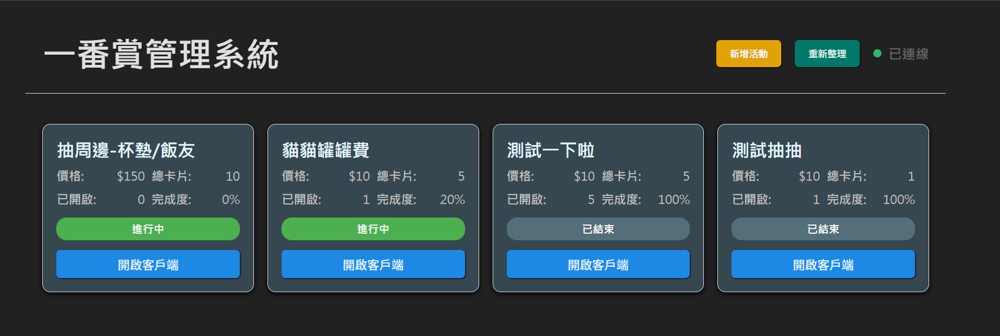
  _(不管是誰抽的、還剩多少獎品，後台通通看得到！)_

- **線上抽籤**：系統會幫妳管理還有幾張籤、剩餘的獎品是什麼，公平又清楚。
  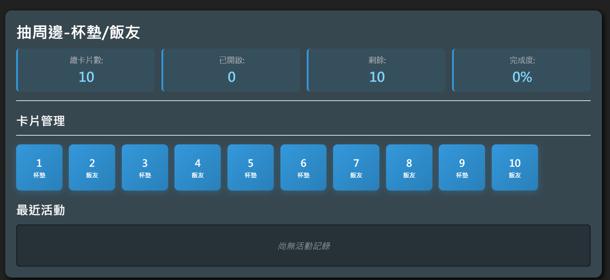
  _(隨時掌握每一抽的狀態，公平公正公開！)_

- **客戶端畫面**：有一個漂亮的畫面可以秀給觀眾看，讓大家更有參與感！(`ichiban-client`)
  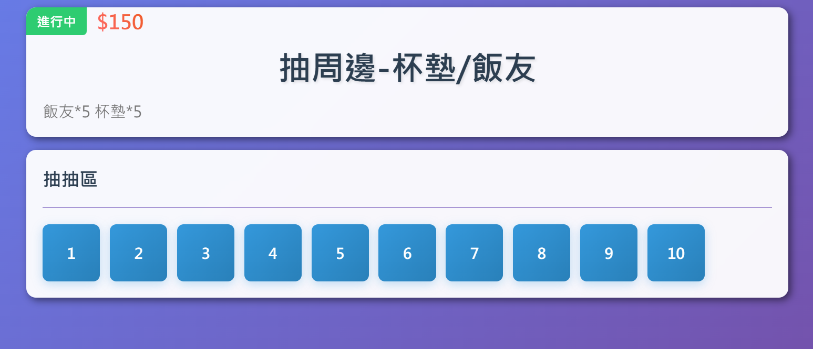
  _(讓觀眾也能看到現在剩幾抽，增加緊張刺激感！)_

### 2. 💰 抖內與募資 (Donations & Fundraising)

怕漏掉粉絲的心意嗎？或是想要集資做一個大企劃？

- **綠界金流 (ECPay) 與 PayUni 整合**：系統支援綠界與 PayUni 兩種金流，妳可以擇一設定或兩者都設定。觀眾在斗內頁可以選擇「用綠界斗內」或「用 PayUni 斗內」，用信用卡、ATM 轉帳等方式支持妳。
- **募資活動**：設定一個目標金額（例如：3D 化募資！），讓大家一起看著進度條往前衝。

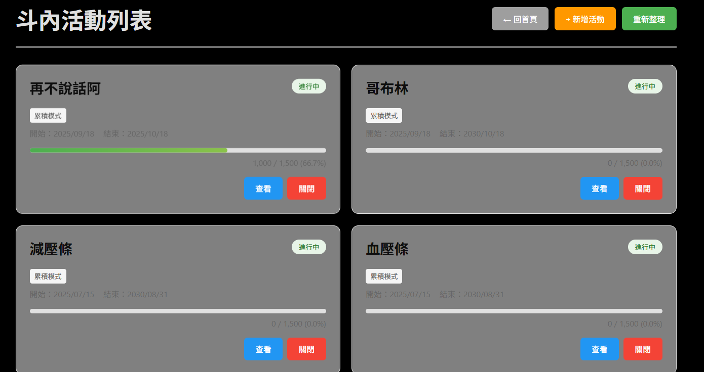
_(可以同時進行好幾個活動喔！)_

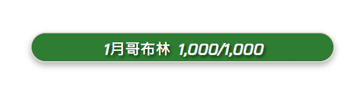
_(看著進度條越來越滿，是不是很有成就感呢？)_

- **自動對帳**：粉絲付款成功後，系統會自動顯示

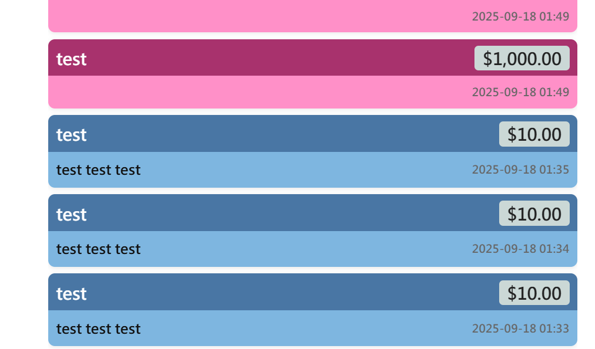
_(誰贊助了多少錢、說了什麼話，全部都幫妳記下來了！)_

### 3. 🎨 斗內頁顏色 (Donate Page Theme)

- **自訂色塊與即時預覽**：在主畫面點選「斗內頁顏色」後，可以調整觀眾看到的斗內頁按鈕、背景等色塊，右側會即時預覽效果，讓斗內頁更符合妳的風格。

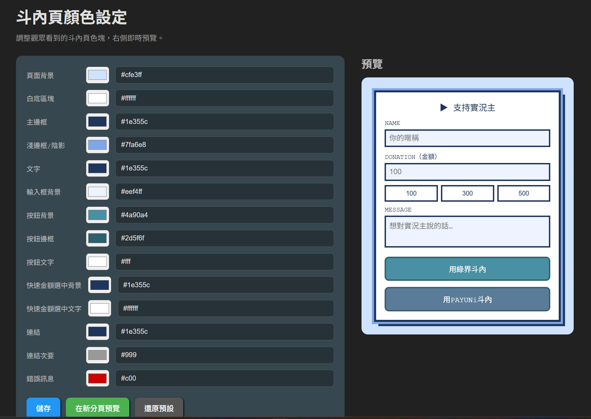
_(在左側調整色塊，右側即時預覽觀眾會看到的樣子！)_

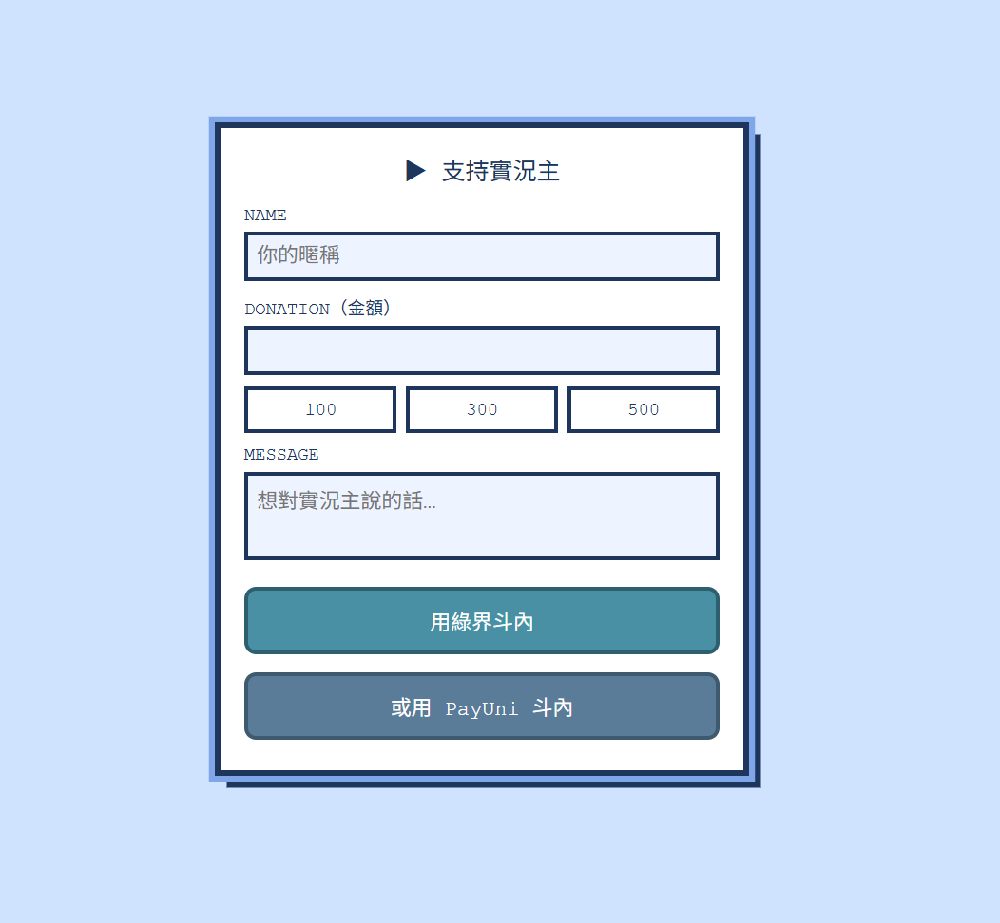
_(觀眾打開斗內連結後看到的贊助介面，風格都可以在這裡自訂喔。)_

### 4. 📺 YouTube 連動 (YouTube Integration)

- **Super Chat 監聽**：系統會幫妳注意有沒有收到 Super Chat，不錯過任何一則抖內留言。
- **但流量可能會爆(#**

### 5. ⚙️ 簡單的後台設定

- **設定頁面**：不用寫程式，在設定頁有「基本設定」「綠界」「YouTube」「PAYUNi」四個分頁。
- **基本設定**：可填寫 **顯示名稱**，這個名稱會用來產生「觀眾斗內連結」，方便妳把連結分享給粉絲。
- **綠界 / PAYUNi**：依妳使用的金流，在對應分頁填入商店代號、Hash Key、Hash IV 即可。

---

## 💖 第一次使用：只需 3 步驟！ (First Time Setup)

打開小幫手程式後，妳會看到登入或設定畫面。只要填入 **綠界 (ECPay)** 或 **PayUni** 其中一種金流的資料，就能開始收款囉！（也可以兩種都填，讓觀眾自己選要用哪個付款。）

### 步驟 1：準備好鑰匙 🗝️

請依妳要使用的金流，到對應的後台取得三項資料：**商店代號**、**Hash Key**、**Hash IV**。

**若使用綠界 (ECPay)**：登入綠界後台（或測試環境後台），依照下圖指示：

1. 點選左側選單的 **「系統設定」**
2. 選擇 **「系統介接設定」**
3. 就能找到我們需要的三個資料囉！

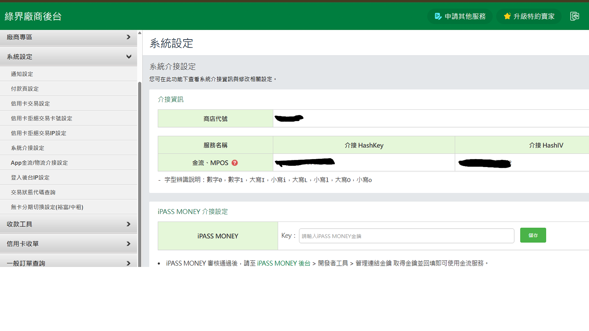
_(記得要在這邊找到這三串神秘代碼喔！)_

- **商店代號 (Merchant ID)**：這是妳的商店身分證。
- **Hash Key**：這是第一把密碼鑰匙。
- **Hash IV**：這是第二把密碼鑰匙。

**若使用 PayUni**：可以到 PayUni 網站註冊，照說明書填寫資訊即可。要取得小幫手需要的三項資料時，請登入 PayUni 後台，點選 **「串接設定」** 分頁，裡面的 **商店代號**、**Hash Key**、**Hash IV** 就是網站註冊用的資訊。

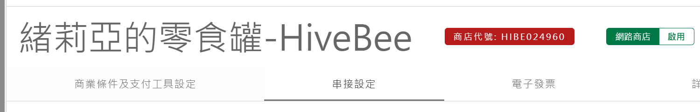
_(在「串接設定」裡找到商店代號、Hash Key、Hash IV 喔！)_

### 步驟 2：輸入資料 📝

回到小幫手的畫面：

- 若是**第一次設定**（例如被帶到「商店金流設定」頁），請選擇 **綠界 ECPay** 或 **PAYUNI** 分頁，在對應欄位填入剛剛找到的三個資料。
- 若已進入主畫面，可點 **設定**，在 **綠界** 或 **PAYUNi** 分頁中填寫。

**PayUni 使用者**：在小幫手的「商店金流設定」頁選 **PAYUNI** 分頁，依序填入商店代號、Hash Key、Hash IV。

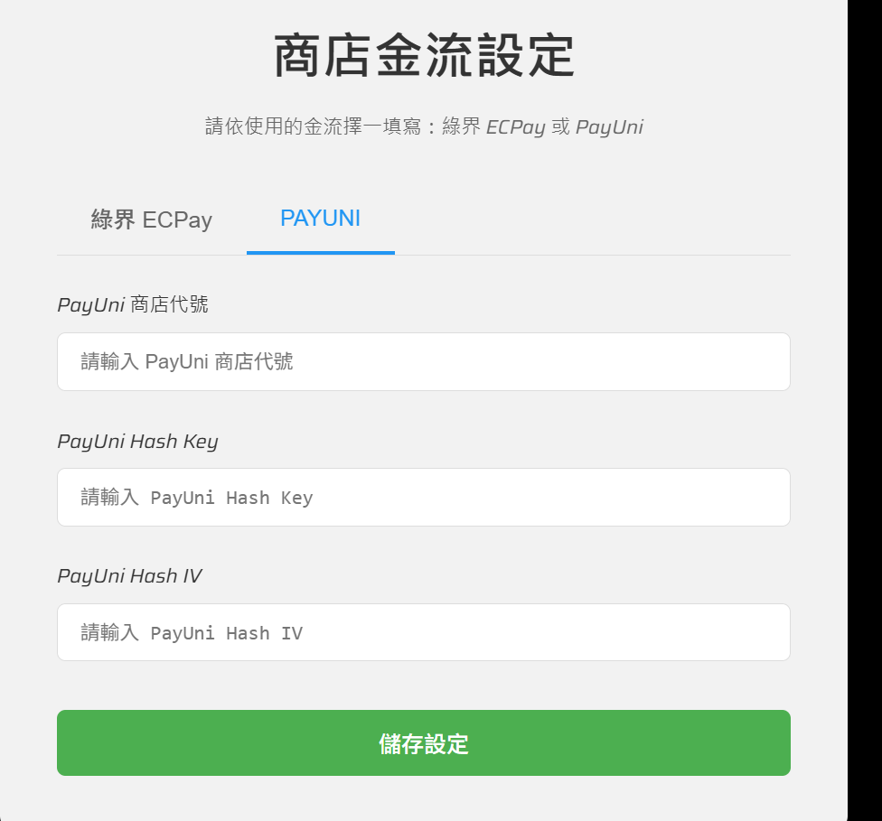
_(選 PAYUNI 分頁，把串接設定裡的三個資料填進來！)_

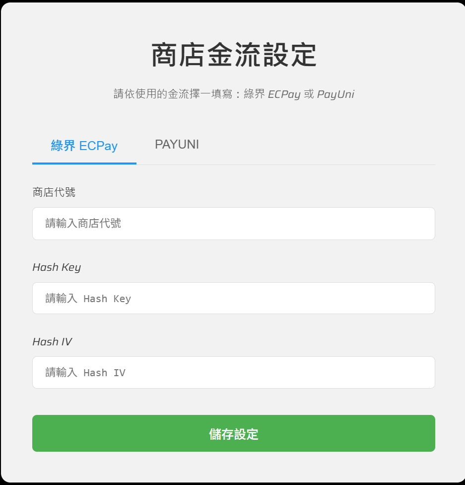
_(把剛剛找到的資料填進來，不用擔心，這個只會存在妳的電腦裡！)_

- **商店代號**：填入對應金流的 Merchant ID
- **Hash Key**：填入 Hash Key
- **Hash IV**：填入 Hash IV

### 步驟 3：儲存並開始 ✨

按下 **「儲存設定」** 按鈕。
如果是第一次設定，系統會自動帶妳進入主畫面，這時候魔法就生效啦！
以後妳的一番賞、募資活動，都會自動連結到這個商店帳號喔！
若使用 PayUni，之後登入時可以用 **PayUni 商店代號** 登入。

### ⚠️ 重要提醒：設定回傳網址

為了讓小幫手知道有人付款成功了，必須在**金流後台**設定「回傳網址」或「通知網址」。

**綠界**：請在綠界後台的 **系統介接設定** 中，將「回傳網址」或「付款結果通知網址」填為以下網址。請把 `你的商店代號` 換成妳的綠界商店代號；若自架，另將 `你的網站網址` 換成妳的網域：

`https://你的網站網址/api/v1/comme/ecpay/id=你的商店代號`

例如（雲端版）：`https://ecpay-web.onrender.com/api/v1/comme/ecpay/id=3297107`

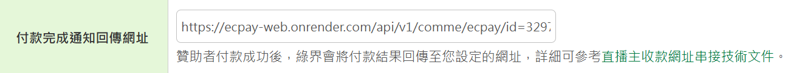
_(這樣粉絲抖內成功時，小幫手才會馬上知道並跳出通知！)_

**PayUni**：若使用 PayUni，請在 PayUni 後台的 **串接設定** 裡，先填 **Notify URL** 就好。網址格式如下，請把最後的 `你的商店代號` 換成妳的 PayUni 商店代號（例如 HIBE024960）：

`https://你的網站網址/api/v1/comme/payuni/id=你的商店代號`

例如：`https://ecpay-web.onrender.com/api/v1/comme/payuni/id=HIBE024960`

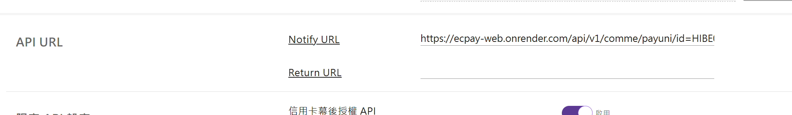
_(在 PayUni 後台串接設定裡填上 Notify URL，小幫手才能在粉絲付款成功時收到通知！)_

---

### 🔒 關於隱私與權限 (Privacy & Permissions)

請大家放心使用！這個小幫手非常重視妳的隱私：

- **綠界金流權限**：系統只會使用妳提供的 API 資料來幫妳「呼叫綠界」處理金流，**絕對不會**獲取額外的個資。這些資料只會寫入系統運作必要的資料庫中，請安心！
- **PayUni 金流權限**：同樣僅使用妳提供的 API 資料（商店代號、Hash Key、Hash IV）來處理金流，不獲取額外個資；資料僅用於系統運作必要之儲存。
- **YouTube 功能**：小幫手使用的是開發者（鼠鼠我本人 🐹）自己的 YouTube API 配額，所以完全 **不需要** 跟妳索取 YouTube 帳號權限喔！
    - _(小提醒：因為是共用鼠鼠的額度，如果大家太熱情可能會偶爾滿出來，但一樣不會影響到妳的帳號安全喔～)_
